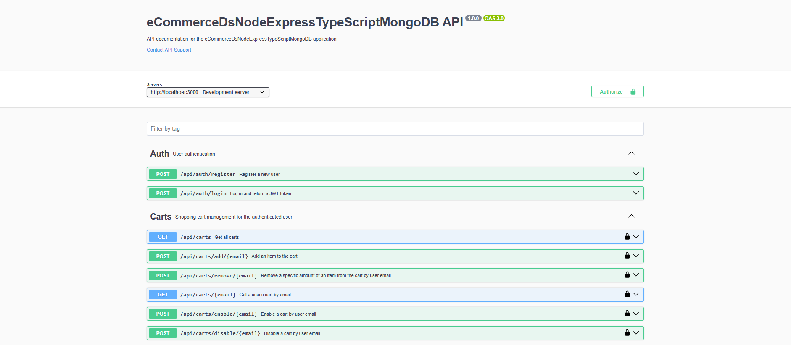
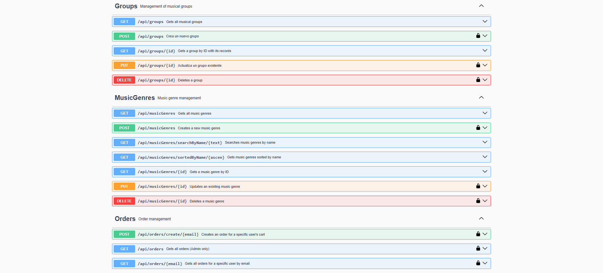
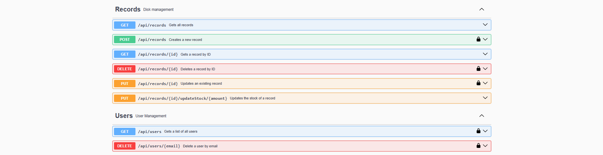

## eCommerceDsNodeExpress_TypeScriptMongoDB

**eCommerceDsNodeExpress_TypeScriptMongoDB** is an Nodejs+Express API project. It is the backend service layer for an e-commerce application, focused on data management. The Repository implements the data access logic. The Services contain the application's business logic. Key features implemented in the project include: Authentication and Authorization, User Management, Catalog Management, Shopping Cart Management and Order Management. It uses TypeScript, MongoDB and JWT for authentication. Images are not uploaded locally, the https://imgur.com service is used.


eCommerceDsNodeExpress_TypeScriptMongoDB/    
├── src/      
│   ├── config/     
│   │      ├── database.ts     
│   │      ├── swagger.ts    
│   ├── controllers/     
│   │      ├── authController.ts        
│   │      ├── cartsController.ts    
│   │      ├── groupsController.ts  
│   │      ├── musicGenresController.ts  
│   │      ├── ordersController.ts  
│   │      ├── recordsController.ts    
│   │      └── usersController.ts    
│   ├── middleware/     
│   │      └── authMiddleware.ts        
│   ├── models/     
│   │      ├── Cart.ts      
│   │      ├── Group.ts    
│   │      ├── index.ts    
│   │      ├── MusicGenre.ts    
│   │      ├── Order.ts    
│   │      ├── Record.ts    
│   │      └── User.ts    
│   ├── routes/     
│   │      ├── authRoutes.ts     
│   │      ├── cartsRoutes.ts    
│   │      ├── groupsRoutes.ts    
│   │      ├── musicGenreRoutes.ts   
│   │      ├── ordersRoutes.ts   
│   │      ├── recordsRoutes.ts   
│   │      └── usersRoutes.ts    
│   ├── services/         
│   │      ├── cartService.ts    
│   │      ├── groupService.ts    
│   │      ├── musicGenreService.ts    
│   │      ├── orderService.ts   
│   │      ├── recordService.ts   
│   │      └── userService.ts    
│   └─ server.ts    
├── .env  
├── package.json  
└── tsconfig.json  






## database.ts
```ts 
const MONGODB_URI = process.env.MONGODB_URI;
``` 

[DeepWiki moraisLuismNet/eCommerceDsNodeExpress_TypeScriptMongoDB](https://deepwiki.com/moraisLuismNet/eCommerceDsNodeExpress_TypeScriptMongoDB)